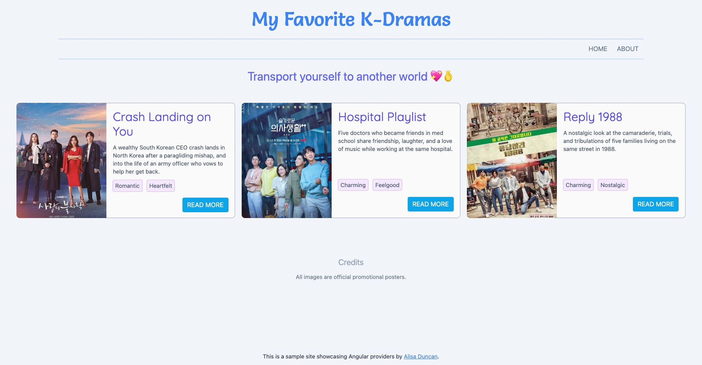

# Angular Practical Providers Code Example



This is a K-Drama fan site showcasing Angular dependency injection configurations. 

The code in this repo is used by [Practical Guide to Providers](https://practicalguidetoproviders.alisaduncan.dev/) presentation.

This project was generated with [Angular CLI](https://github.com/angular/angular-cli) version 14.1.2.

## Environment setup instructions

```console
git clone 
npm ci
```

Run `ng serve` for a dev server. Navigate to `http://localhost:4200/`. The application will automatically reload if you change any of the source files.

